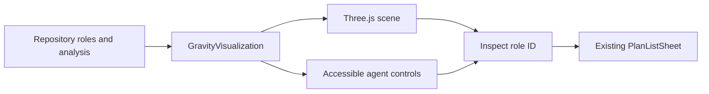

# Agent solar system

The original Black Hole Orchestrator's Agent Orbit is an interactive Three.js scene. Each planet represents a real `AgentRole`; the central black hole represents the current repository. Role IDs, analysis status, task summaries, and existing plan-sheet actions remain owned by the application.

The renderer uses a view-dependent, artistic approximation of gravitational lensing, an emitting accretion disk, procedural starfield, and six reusable planet styles with locally authored Blender textures. Atmospheres, terrain, cloud rotation, rings, eclipse shadows, and orbiting moons provide depth at close range. No remote asset service is required. The original spaceship model loads only when requested.

## Operator behavior

- All roles remain represented, including empty, one-agent, and larger repositories. Analysis status takes precedence over stored role status.
- Click a planet or its projected name to open its existing plans. The bottom chooser focuses a world without opening the sheet; **View agent plans** opens it explicitly.
- Drag to orbit, scroll to zoom, and reset to recover the full system. The camera follows the selected world's orbit through live status changes. Drifting agents stay within reach.
- Hovering a planet pauses celestial motion. Pause also respects the initial reduced-motion setting; an explicit operator choice overrides it. Camera transitions honor reduced motion.
- Fullscreen exits before opening the application’s portal-based plan sheet. Reset cancels pending spaceship camera requests. Spaceship loading failure leaves ordinary scene controls available.
- Keyboard controls and a horizontally scrollable agent chooser work within narrow embedded panels. Offscreen scenes stop rendering; adaptive resolution keeps GPU cost bounded. Unmount releases GPU resources and event listeners.

## Local preview and validation

Run `npm run dev:solar` and open `http://127.0.0.1:4176/solar-preview.html`. This standalone frontend preview uses explicitly labeled synthetic data and never changes repository data or starts the backend. The production application continues to use the original repository page.

Run `npm test`, `npm run check`, `npm run build`, and `npm run test:e2e`. Browser tests run serially to isolate GPU load; evidence is saved outside the repository under `/tmp/black-hole-orchestrator-browser-results`. They cover role identity and canvas picking, status changes, empty and larger role sets, pause, reduced motion, fullscreen callbacks, spaceship cancellation/failure, mobile keyboard access, the real repository plan sheet, and a 45 FPS minimum at 1280 × 900. Performance is hardware-dependent.

The local assets can be rebuilt with the command in `client/public/assets/solar/README.md`. The black-hole shader is an art-directed visualization, not a scientific relativity simulator.
